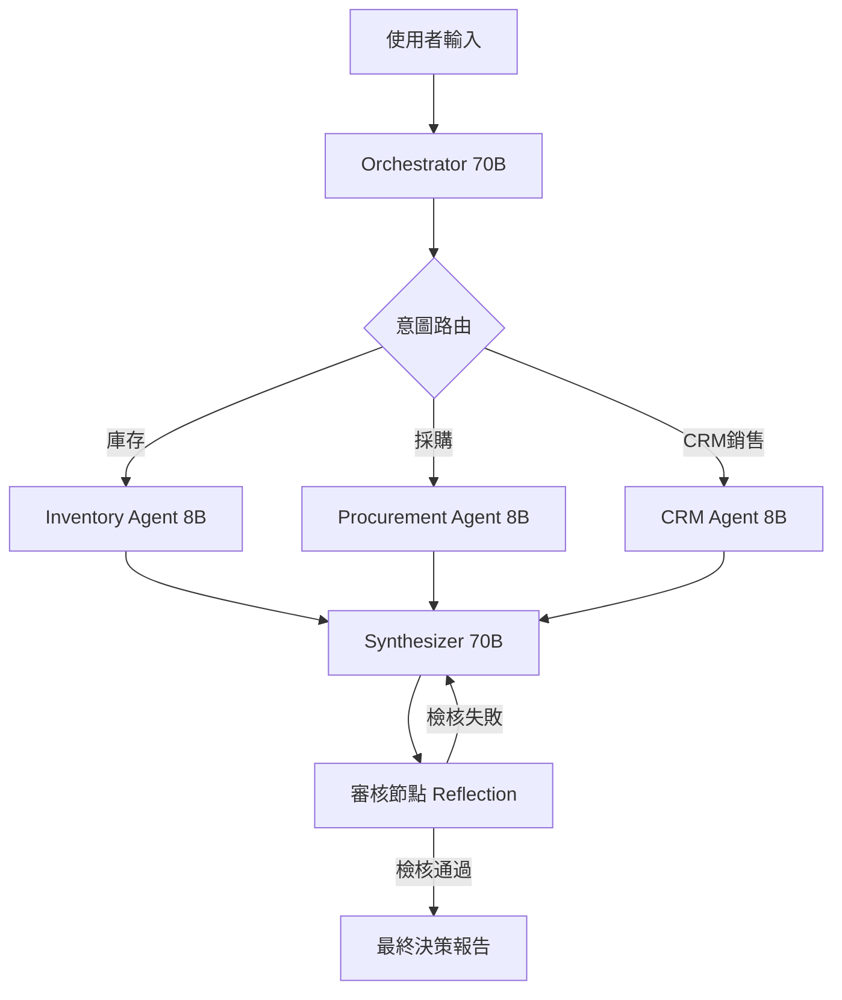

# OmniAgent ERP: 多智能體企業資源規劃系統

OmniAgent ERP 是一個基於 **LangGraph** 與 **Model Context Protocol (MCP)** 構建的企業級多智能體 (Multi-Agent) 系統。它負責調度多個專業領域的 Agent，用以管理庫存、採購與 CRM 銷售分析流程，具備高度可靠性與企業級的防護機制。

## 核心技術亮點

*   **多智能體協作 (Multi-Agent Orchestration)**：利用 LangGraph 狀態機 (State Machine) 精準管理跨 Agent 的複雜決策工作流。
*   **標準化工具協議 (MCP)**：實作 Model Context Protocol，將底層商業邏輯與 LLM 解耦，確保數據接地 (Data Grounding) 的標準化。
*   **混合模型策略 (Hybrid Model Strategy)**：
    *   **指揮官 (70B)**：使用 Llama 3.3 70B 負責高階邏輯推理與最終結果整合。
    *   **執行員 (8B)**：使用 Llama 3.1 8B 負責快速、低成本的工具呼叫執行。
*   **模組化架構 (Skill-Based Architecture)**：將庫存、採購與客戶關係管理等商業邏輯，解耦並封裝為獨立的技能節點。

## AI 工程實踐 (防護圍籬 Guardrails)

針對 LLM 的幻覺問題與生產環境穩定性挑戰，本系統實作了以下機制：
*   **邏輯攔截器 (Logic Interceptors)**：從程式碼層級實作實體驗證，直接物理攔截模型嘗試搜尋不存在實體（如無關商品或未註冊客戶）的幻覺行為。
*   **熔斷保護 (Meltdown Protection)**：嚴格限制單次對話的工具呼叫上限，並具備重複請求的即時阻斷功能。
*   **延遲緩衝 (Rate-Limit Buffering)**：內建請求延遲機制，優雅應對 API 速率限制 (Rate Limits) 問題。
*   **滑動上下文視窗 (Sliding Context Window)**：動態縮減對話歷史，優化 Token 消耗並強制 Agent 聚焦於當前任務。

## 系統工作流



## 目錄結構
```text
├── main.py             # 核心編排邏輯 (LangGraph State Machine)
└── mcp_server.py       # MCP 工具註冊架構 (模擬實作版)
```

> **備註 (Notice)**：本專案的核心演算法實作、真實資料庫連線邏輯與 QA 端到端評估模組，已作為專有智慧財產權 (Proprietary IP) 保留於私人倉庫中。本公開倉庫僅作為高階架構範本展示。

## 快速啟動
1. **安裝依賴**: `pip install -r requirements.txt`
2. **環境設定**: 複製 `.env.example` 為 `.env` 並填入您的 API 金鑰。
3. **啟動 MCP 伺服器**: `python mcp_server.py`
4. **執行 Agent**: `python main.py`

---
*本專案為技術架構展示，展示中所有資料皆為模擬生成。*
